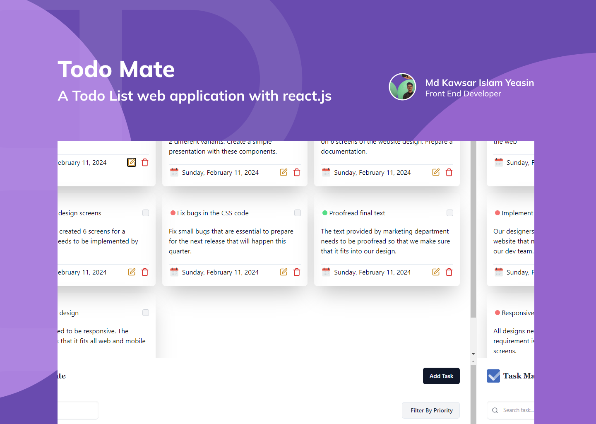

### Task-Mate

### Technologies

### Description

Task-Mate is a web application designed to manage your daily tasks. Built with React.js, one of the most popular JavaScript libraries for building user interfaces, Task-Mate offers a seamless and interactive user experience.

Stay tuned for these exciting updates and experience a new way of managing your tasks with Task-Mate!

### Features

- Allows users to create, update, and delete tasks
- With its clean and user-friendly interface,
- data persist in local storage, Even if you refresh the page, your tasks will still be there.
- Each task will also have a priority (low/ medium/ high). and indicated via through different colors
- Task Management: Users can create, update, and delete tasks
- Filter tasks by priority
